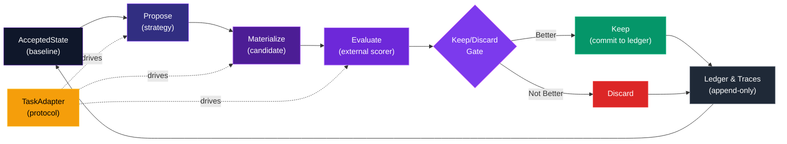

<svg width="800" height="200" viewBox="0 0 800 200" xmlns="http://www.w3.org/2000/svg" style="display: block; margin: 0 auto;">
  <defs>
    <linearGradient id="headerGradient" x1="0%" y1="0%" x2="100%" y2="100%">
      <stop offset="0%" style="stop-color:#0f172a;stop-opacity:1" />
      <stop offset="50%" style="stop-color:#312e81;stop-opacity:1" />
      <stop offset="100%" style="stop-color:#4c1d95;stop-opacity:1" />
    </linearGradient>
    <filter id="glow">
      <feGaussianBlur stdDeviation="3" result="coloredBlur"/>
      <feMerge>
        <feMergeNode in="coloredBlur"/>
        <feMergeNode in="SourceGraphic"/>
      </feMerge>
    </filter>
  </defs>
  <rect width="800" height="200" rx="12" fill="url(#headerGradient)"/>
  <text x="400" y="70" font-size="48" font-weight="bold" text-anchor="middle" fill="white" font-family="system-ui, -apple-system, sans-serif">
    autoresearch-evaluation-harness
  </text>
  <text x="400" y="115" font-size="24" text-anchor="middle" fill="#e0e7ff" font-family="system-ui, -apple-system, sans-serif">
    评估为先的自动研究框架
  </text>
  <text x="400" y="150" font-size="16" text-anchor="middle" fill="#c7d2fe" font-family="system-ui, -apple-system, sans-serif" opacity="0.9">
    Evaluation-First Autoresearch Harness
  </text>
</svg>

---

<div align="center">

[](https://www.python.org/)
[](LICENSE)
[](docs/launch/2026-03-28-github-launch-notes.md)
[](docs/superpowers/plans/2026-03-27-frozen-evaluation-interim-report.md)

[English](README_en.md) · [中文](README.md) · [Launch Notes](docs/launch/2026-03-28-github-launch-notes.md)

</div>

---

## 🎯 一句话描述 | One-Liner

一个以**评估为先**的 `autoresearch` 风格实验框架，用固定 task adapter、明确的标量评估信号和硬性 keep/discard gate 来比较不同 proposal strategy。

An evaluation-first harness for `autoresearch`-style loops comparing proposal strategies under fixed task adapters, explicit scalar evaluation, and hard keep/discard gates.

---

## 💡 三句话价值主张 | Three-Sentence Value Proposition

1. **不是展示 agent 花样**：它首先是一个 **evaluation harness**，用同一套 task adapter 和 benchmark 去比较不同 proposal strategy，而不是只看单次最好分。

2. **让 LLM 进场，但不让它自证成功**：LLM 可以参与 proposal，但成功与否必须由**外部 evaluator**、report 和 keep/discard gate 决定。

3. **把泛化问题留给 held-out 去说话**：默认 benchmark 与 held-out 检查分开，避免一边调系统、一边把 held-out 也调脏。

---

## 🏗️ 核心架构 | Core Architecture



---

## 📊 Task Adapter 类型 | Task Adapter Types

| Adapter | 测试对象 | 用途 | 输出格式 |
|---------|---------|------|---------|
| **Numeric** | 数值拟合 | 找最优参数值 | 纯数值 score |
| **Prompt** | Prompt 优化 | 改进模型提示词 | prompt + score |
| **Bugfix** | 代码纠正 | 定位并修复 bug | 修复代码 + score |
| **Code Repair** | 测试驱动修复 | 通过测试用例验证 | 修复代码 + pass rate |
| **Mixed** | 多阶段复合 | 同时优化多个维度 | composite_summary + scores |
| **DL/Proxy** | 深度学习代理 | CPU 友好型 ML 任务 | 模型权重 + score |
| **Held-Out** | 泛化验证 | 测试在新任务上的表现 | 交叉验证 score |

---

## 🚀 快速开始 | Quick Start

### 安装 | Installation

```bash
git clone https://github.com/sou350121/autoresearch-evaluation-harness.git
cd autoresearch-evaluation-harness
pip install -e .
```

### 基础命令 | Basic Commands

```bash
# 建立 baseline
python -m src.autoresearch_plus.cli baseline

# 运行 8 轮搜索
python -m src.autoresearch_plus.cli search --iterations 8

# 生成报告
python -m src.autoresearch_plus.cli report

# 在默认任务上跑 benchmark（2 trials × 8 iterations）
python -m src.autoresearch_plus.cli benchmark --iterations 8 --trials 2

# 在特定任务上运行（如 breast_cancer_classification）
python -m src.autoresearch_plus.cli benchmark --iterations 1 --trials 3 --task breast_cancer_classification

# 在 held-out task 上验证泛化（需显式 --task）
python -m src.autoresearch_plus.cli benchmark --iterations 1 --trials 3 --task wine_classification
```

### 工作流 | Workflow

1. **查看当前 baseline**：`python -m src.autoresearch_plus.cli report`
2. **运行搜索循环**：`python -m src.autoresearch_plus.cli search --iterations N`
3. **检查进度**：再次 `report`，对比新 accepted state
4. **交叉验证**：用 `benchmark` 在其他 task 验证稳定性
5. **审计痕迹**：`runs/traces/` 中的 JSON trace，`runs/results.tsv` 中的 ledger

---

## 📁 仓库结构 | Repository Structure

<details open>
<summary><strong>展开/折叠</strong></summary>

```
autoresearch-evaluation-harness/
│
├── README.md                          # 中文 README（本文件）
├── README_en.md                       # English README
├── pyproject.toml                     # 项目配置
│
├── config/
│   └── project.toml                   # 实验配置与任务定义
│
├── programs/
│   └── default.md                     # 面向 agent 的自然语言运行规则
│
├── src/autoresearch_plus/
│   ├── __init__.py
│   ├── adapter.py                     # 通用 TaskAdapter 协议
│   ├── composite_adapter.py           # 多阶段复合 adapter
│   ├── engine.py                      # 任务无关的 baseline/search 引擎
│   ├── cli.py                         # CLI 入口（baseline, search, report, benchmark）
│   ├── ledger.py                      # append-only 实验账本
│   ├── chunker.py                     # AST 分块器
│   ├── prior.py                       # 历史偏置（bias selection）
│   ├── mutator.py                     # AST 变异生成器
│   ├── numeric_demo_adapter.py        # 数值优化 demo adapter
│   ├── prompt_demo_adapter.py         # Prompt 优化 demo adapter
│   ├── bugfix_demo_adapter.py         # Bug 修复 demo adapter
│   ├── code_repair_demo_adapter.py    # 测试驱动修复 demo adapter
│   ├── mixed_*.py                     # 混合 adapter 实现
│   ├── dl_demo_adapters.py            # Deep learning CPU 代理
│   └── proposers.py                   # 可插拔搜索策略（single_step_random, chunked_prior）
│
├── tests/                             # 全套单元与集成测试
│   ├── test_adapter.py
│   ├── test_engine.py
│   ├── test_ledger_cli.py
│   ├── test_proposers.py
│   └── ...（15+ 测试文件）
│
├── demo_target/                       # 默认可编辑 demo target
│   ├── train.py                       # 可变目标代码
│   └── eval.py                        # 外部 evaluator（输出 SCORE=<float>）
│
├── demo_prompt/                       # Prompt 优化示例
│   ├── prompt.md                      # 可编辑 prompt artifact
│   └── eval.py                        # Prompt 评分器
│
├── demo_bugfix/                       # Bug 修复示例
│   ├── buggy_math.py                  # 包含 bug 的代码
│   └── eval.py                        # Bug 修复评分器
│
├── demo_code_repair/                  # 测试驱动修复示例
│   ├── calculator.py                  # 需要修复的模块
│   └── eval.py                        # 测试驱动评分器
│
├── demo_circles_classification/       # 非线性分类
│   ├── task.py
│   └── eval.py
│
├── demo_digits_image_classification/  # 图像分类
│   ├── task.py
│   └── eval.py
│
├── demo_diabetes_regression/          # 回归任务
│   ├── task.py
│   └── eval.py
│
├── demo_breast_cancer_classification/ # 表格数据分类
│   ├── task.py
│   └── eval.py
│
├── demo_wine_classification/          # **held-out 任务**
│   ├── task.py
│   └── eval.py
│
├── demo_friedman1_regression/         # **held-out 回归**
│   ├── task.py
│   └── eval.py
│
├── demo_ve_gate_proxy/                # Value Embedding / Gate proxy
│   ├── task.py
│   └── eval.py
│
├── demo_optimizer_schedule_proxy/     # Optimizer schedule proxy
│   ├── task.py
│   └── eval.py
│
├── demo_capacity_budget_proxy/        # Capacity/budget coupling proxy
│   ├── task.py
│   └── eval.py
│
├── docs/
│   ├── launch/
│   │   └── 2026-03-28-github-launch-notes.md   # GitHub 发布文案
│   └── superpowers/plans/
│       ├── 2026-03-27-frozen-evaluation-interim-report.md  # 评估结果
│       └── 2026-03-28-held-out-task-plan.md                # Held-out 计划
│
└── runs/                              # 运行结果与追踪
    ├── results.tsv                    # append-only 实验账本
    ├── traces/                        # 每次运行的 JSON trace
    └── accepted_snapshots/            # accepted target 的快照
```

</details>

---

## 🔬 核心概念 | Core Concepts

### TaskAdapter 协议 | TaskAdapter Protocol

每个任务必须实现 `TaskAdapter` 协议：

```python
class TaskAdapter(Protocol):
    def load_accepted_state(self) -> str:
        """加载上一次 accepted 的 baseline state"""
        ...

    def propose(self, accepted_state: str) -> str:
        """基于 accepted state 提出候选修改"""
        ...

    def materialize(self, proposal: str) -> str:
        """将提案具体化为可执行代码"""
        ...

    def evaluate(self, candidate: str) -> float:
        """运行外部 evaluator，返回标量分数"""
        ...

    def is_better(self, new_score: float, old_score: float) -> bool:
        """比较两个分数：new 是否比 old 更好？"""
        ...

    def promote(self, candidate: str) -> None:
        """将被 accept 的 candidate 推广为新 baseline"""
        ...
```

### Keep/Discard Gate | Keep/Discard Gate

每次搜索迭代后的硬性决策：

- **Keep**：新分数 > 当前最佳分数 → 更新 accepted state，写入 ledger
- **Discard**：新分数 ≤ 当前最佳分数 → 丢弃修改，不影响 baseline
- **Ledger**：所有决策都被记录，包括 keep 和 discard，确保完整的审计线

### Ledger & Traces | 账本与追踪

- **`runs/results.tsv`**：append-only 账本，每行一次运行（keep 或 discard）
- **`runs/traces/run_*.json`**：完整的运行追踪，包含 proposal、evaluation 过程、scores
- **`runs/accepted_snapshots/`**：每次 keep 时保存 accepted state 的快照

### Prior-Biased Search | 历史偏置搜索

系统从最近的 accepted/rejected 运行历史中学习：

- 最近 **keep** 的修改类型会被提高优先级
- 最近 **discard** 的修改类型会被降低优先级
- 通过 `chunked_prior` 策略实现自适应搜索空间缩小

---

## 🎯 设计哲学 | Design Philosophy

### 为什么存在 | Why This Exists

`karpathy/autoresearch` 的优雅之处在于它的约束非常强。

我研究过的其他系统在 persistence、memory、branching 和 evaluation infrastructure 上更强，但它们也明显更重：

- **theam/autonomous-researcher**：持久化研究操作系统
- **ResearAI/DeepScientist**：quest 与 artifact 平台
- **MiroMindAI/MiroThinker**：benchmark-heavy 研究 agent 系统

**这个仓库想占据的是中间位置**：

✓ 仍然小（单 Python 包，~2000 LOC core）
✓ 仍然 metric-driven（硬性 keep/discard，可追踪）
✓ 仍然容易解释（完整 trace，append-only ledger）
✓ 但已经有足够的结构去重复运行，而不至于失去上下文

### 它相信什么 | What It Believes

- **Evaluation-first**：不能用分数衡量的改进不算改进
- **Task-dependent**：没有一个通用最优策略；必须按任务调参
- **Transparency**：所有运行都被记录；没有隐藏的 state 改动
- **Held-out matters**：默认 benchmark 和 held-out task 分离，避免过拟合

---

## 📈 当前状态 | Current Status

### 已具备 | What Works

- ✅ 可运行的 `baseline → search → report → benchmark` 主流程
- ✅ 支持多类 task adapter（numeric、prompt、bugfix、code-repair、mixed、DL/proxy）
- ✅ Opt-in held-out task（wine_classification、friedman1_regression）
- ✅ 完整 trace & ledger 系统
- ✅ 历史偏置搜索（chunked_prior）
- ✅ Composite adapter 与多阶段评分

### 最诚实的定位 | Most Honest Positioning

🎯 **这是一个高质量的 evaluation harness，而非已证明通用性的 research agent**

系统表现明显 **task-dependent**：

- 在某些任务上 `llm_codex` 明显优于 baseline
- 在某些任务上 baseline 已经饱和
- 在某些任务上 `memory + retry` 没有帮助

---

## 🚫 这个仓库不主张什么 | What This Repo Does NOT Claim

- ❌ **不主张 broad generalization**：没有证据显示同一策略在所有任务上都更优
- ❌ **不主张 llm_codex 已普遍强于 non-LLM baseline**：task-dependent 的
- ❌ **不主张 memory + retry 已具备 broad independent value**：需要具体任务验证
- ❌ **不主张已经以一般形式解决 unknown-method problem**：只是一个 benchmark harness

---

## 🔄 默认 Benchmark 与 Held-Out | Default Benchmark vs Held-Out

**默认 benchmark 任务**（日常使用）：
- `numeric`（demo_target）
- `prompt`（demo_prompt）
- `bugfix`（demo_bugfix）
- `code_repair`（demo_code_repair）
- `circles_classification`
- `digits_image_classification`
- `diabetes_regression`
- `breast_cancer_classification`

**Held-Out 任务**（验证泛化，必须显式 `--task`）：
- `wine_classification`
- `friedman1_regression`

```bash
# ❌ 不会跑 held-out
python -m src.autoresearch_plus.cli benchmark --iterations 8 --trials 2

# ✅ 显式指定 held-out 任务
python -m src.autoresearch_plus.cli benchmark --iterations 1 --trials 3 --task wine_classification
```

---

## 🛠️ 如何自定义 | How To Adapt It

### 最小适配步骤 | Minimal Adaptation Steps

在扩展 loop logic **之前**，只替换这三样：

1. **`config/project.toml`** → 定义你的任务与 adapter 类型
2. **`demo_target/train.py`** → 你要优化的目标代码
3. **`demo_target/eval.py`** → 你的外部 evaluator（输出 `SCORE=<float>`）

然后运行：

```bash
python -m src.autoresearch_plus.cli baseline
python -m src.autoresearch_plus.cli search --iterations 8
python -m src.autoresearch_plus.cli report
```

### 高级：自定义 TaskAdapter | Advanced: Custom TaskAdapter

如果你需要多阶段评分、特殊的 proposal 逻辑或自定义 evaluation，创建一个新的 adapter 类继承 `TaskAdapter`，在 `config/project.toml` 中注册，然后在 CLI 中指定 `--adapter your_adapter_name`。

详见 `src/autoresearch_plus/` 中的 adapter 实现示例。

---

## 📚 计划与报告 | Plans & Reports

| 文档 | 描述 |
|------|------|
| [**GitHub Launch Notes**](docs/launch/2026-03-28-github-launch-notes.md) | GitHub 公开发布的官方文案与 repo 描述 |
| [**Frozen Evaluation Report**](docs/superpowers/plans/2026-03-27-frozen-evaluation-interim-report.md) | 当前 frozen-evaluation 的证据、claim 与局限 |
| [**Held-Out Task Plan**](docs/superpowers/plans/2026-03-28-held-out-task-plan.md) | Wine & Friedman1 held-out 任务的计划与实现记录 |

---

## 🤝 Contributing

详见 [CONTRIBUTING.md](CONTRIBUTING.md)

我们欢迎：
- Bug 报告与 issue
- 新 task adapter 的提案
- 性能改进
- 文档完善

请确保：
- 所有测试通过：`pytest tests/`
- 代码遵循项目风格
- 新功能附带测试

---

## 📜 License

[MIT License](LICENSE) - 详见 LICENSE 文件

---

<div align="center">

**当前 autoresearch-evaluation-harness 是一个高质量的 evaluation harness。**
**它正在学习成为一个负责任的 research agent。**

Built with ❤️ for systematic, evaluation-driven autoresearch.

</div>
