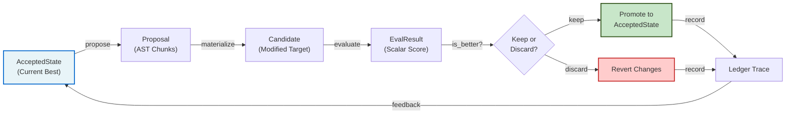

<svg xmlns="http://www.w3.org/2000/svg" viewBox="0 0 800 200" width="800" height="200" style="border-radius: 12px; overflow: hidden;">
  <defs>
    <linearGradient id="headerGradient" x1="0%" y1="0%" x2="100%" y2="100%">
      <stop offset="0%" style="stop-color:#1e3c72;stop-opacity:1" />
      <stop offset="100%" style="stop-color:#7a2e7e;stop-opacity:1" />
    </linearGradient>
  </defs>
  <rect width="800" height="200" fill="url(#headerGradient)"/>
  <text x="400" y="80" font-family="system-ui, -apple-system, sans-serif" font-size="48" font-weight="bold" fill="white" text-anchor="middle">autoresearch-evaluation-harness</text>
  <text x="400" y="140" font-family="system-ui, -apple-system, sans-serif" font-size="20" fill="#e0d5ff" text-anchor="middle" opacity="0.95">Evaluation-First Harness for Autoresearch-Style Loops</text>
</svg>

---

<div align="center">


[**English**](README_en.md) · [**中文**](README.md) · [**Launch Notes**](docs/launch/2026-03-28-github-launch-notes.md)

</div>

---

## What Is This?

An evaluation-first harness for comparing **autoresearch-style proposal strategies** under fixed task adapters, explicit scalar evaluation, and hard keep/discard gates.

The system emphasizes **repeatability, auditability, and task-dependent evidence** over broad generalization claims.

---

## In Three Sentences

1. **This is not a demo of agent tricks.** It is an evaluation harness that compares proposal strategies using the same task adapters, budgets, and evaluation criteria.

2. **The LLM can propose, but cannot judge itself.** Success is determined by external evaluators, reports, and hard keep/discard gates—never by the model's own assessment.

3. **Generalization is checked separately.** Default benchmark and held-out tasks are deliberately separated to prevent tuning away held-out evidence.

---

## 🔬 Architecture



---

## 🏗️ Core Features

| Feature | Purpose | What It Enables |
|---------|---------|-----------------|
| **Task Adapters** | Encapsulates how targets are edited, evaluated, and judged | Numeric fitting, prompt optimization, bugfix, code repair, DL/proxy, held-out validation |
| **Keep/Discard Gate** | Hard filtering based on explicit comparator | Prevents tuning noise; only improvements are recorded |
| **Ledger & Traces** | Append-only log of all trials, with git commit metadata | Full reproducibility; no lost context |
| **Prior-Biased Search** | Uses recent accepted/rejected history to bias chunk selection | Focuses search near local improvements |
| **Composite Adapters** | Multi-stage evaluation with integration bonuses | Supports mixed prompt+code-repair and other pipelines |
| **Held-Out Tasks** | Opt-in validation separate from default benchmark | Prevents fitting to the wrong benchmark |

---

## 🚀 Quick Start

```bash
# Install
pip install -e .

# Run baseline (establish current best)
python -m src.autoresearch_plus.cli baseline

# Run search loop (8 iterations)
python -m src.autoresearch_plus.cli search --iterations 8

# Generate report
python -m src.autoresearch_plus.cli report

# Benchmark with trials (default demo tasks)
python -m src.autoresearch_plus.cli benchmark --iterations 8 --trials 2

# Benchmark a specific task
python -m src.autoresearch_plus.cli benchmark --iterations 1 --trials 3 --task breast_cancer_classification

# Benchmark a held-out task (opt-in)
python -m src.autoresearch_plus.cli benchmark --iterations 1 --trials 3 --task wine_classification
```

The default demo modifies `demo_target/train.py` via AST patches, evaluates with `demo_target/eval.py` (which outputs `SCORE=<float>`), and only keeps improvements.

---

## 📊 Supported Task Adapters

### Default Benchmark (Always Available)

- **numeric**: Numeric function fitting (default demo)
- **prompt**: Prompt optimization for classification
- **bugfix**: Direct bug repair
- **code_repair**: Test-driven code repair
- **mixed_prompt_code_repair**: Multi-stage prompt + code repair
- **mixed_prompt_bugfix**: Multi-stage prompt + bugfix
- **dl_proxy**: CPU-friendly deep learning proxies (value embedding gate, optimizer schedule, capacity/budget coupling)

### Held-Out Tasks (Opt-In with `--task`)

- **wine_classification**: Tabular classification (sklearn Wines dataset)
- **friedman1_regression**: Non-linear regression

---

## 📁 Repository Structure

<details>
<summary><strong>Click to expand full directory layout</strong></summary>

```
autoresearch-evaluation-harness/
├── config/
│   └── project.toml                      # Project config & experiment settings
├── programs/
│   └── default.md                        # Natural language agent rules
├── demo_target/                          # Default editable demo artifact
│   ├── train.py                          # Target for AST patches
│   └── eval.py                           # Scorer (outputs SCORE=<float>)
├── demo_prompt/                          # Prompt optimization demo
│   ├── prompt.md                         # Editable prompt artifact
│   └── eval.py                           # Prompt scorer
├── demo_bugfix/                          # Bug repair demo
│   ├── buggy_math.py                     # Buggy target
│   └── eval.py                           # Bugfix scorer
├── demo_code_repair/                     # Test-driven code repair demo
│   ├── calculator.py                     # Code artifact
│   └── eval.py                           # Code scorer
├── demo_circles_classification/          # Nonlinear binary classification demo
│   ├── task.py                           # ML task artifact
│   └── eval.py                           # Scorer
├── demo_digits_image_classification/     # Image classification demo (sklearn digits)
│   ├── task.py                           # ML artifact
│   └── eval.py                           # Scorer
├── demo_diabetes_regression/             # Regression demo (sklearn diabetes)
│   ├── task.py                           # ML artifact
│   └── eval.py                           # Scorer
├── demo_breast_cancer_classification/    # Tabular classification demo (sklearn)
│   ├── task.py                           # ML artifact
│   └── eval.py                           # Scorer
├── demo_wine_classification/             # Held-out tabular classification (sklearn wines)
│   ├── task.py                           # ML artifact
│   └── eval.py                           # Held-out scorer
├── demo_friedman1_regression/            # Held-out non-linear regression
│   ├── task.py                           # ML artifact
│   └── eval.py                           # Held-out scorer
├── demo_ve_gate_proxy/                   # DL proxy: value embedding + gate
│   ├── task.py                           # Proxy artifact
│   └── eval.py                           # CPU-friendly proxy scorer
├── demo_optimizer_schedule_proxy/        # DL proxy: optimizer/schedule coupling
│   ├── task.py                           # Proxy artifact
│   └── eval.py                           # CPU proxy scorer
├── demo_capacity_budget_proxy/           # DL proxy: capacity/budget coupling
│   ├── task.py                           # Proxy artifact
│   └── eval.py                           # CPU proxy scorer
├── src/autoresearch_plus/
│   ├── adapter.py                        # TaskAdapter protocol definition
│   ├── composite_adapter.py              # Multi-stage adapter composition
│   ├── engine.py                         # Task-agnostic baseline/search engine
│   ├── numeric_demo_adapter.py           # Numeric demo adapter
│   ├── prompt_demo_adapter.py            # Prompt demo adapter
│   ├── bugfix_demo_adapter.py            # Bugfix demo adapter
│   ├── code_repair_demo_adapter.py       # Code repair demo adapter
│   ├── mixed_prompt_code_repair_adapter.py
│   ├── mixed_prompt_bugfix_adapter.py
│   ├── dl_demo_adapters.py               # DL/proxy adapters
│   ├── proposers.py                      # Pluggable search strategies
│   ├── cli.py                            # Command-line interface
│   └── models.py                         # Core data structures
├── runs/
│   ├── results.tsv                       # Append-only ledger (git commit, score, etc.)
│   ├── traces/                           # Per-run JSON traces
│   └── accepted_snapshots/               # Snapshots for exact baseline recovery
├── docs/
│   ├── launch/
│   │   └── 2026-03-28-github-launch-notes.md
│   ├── superpowers/plans/
│   │   ├── 2026-03-27-frozen-evaluation-interim-report.md
│   │   ├── 2026-03-28-held-out-task-plan.md
│   │   └── (other plans)
├── tests/                                # Test suite
├── LICENSE                               # MIT License
├── README.md                             # Chinese README (primary)
├── README_en.md                          # English README
└── pyproject.toml                        # Python package config
```

</details>

---

## 🧠 Core Concepts

### TaskAdapter Protocol

Every task is driven by a `TaskAdapter` that implements this interface:

```python
class TaskAdapter(Protocol):
    name: str

    # Load the current best state
    def load_accepted_state(self) -> AcceptedState: ...

    # Restore a saved state
    def restore(self, accepted: AcceptedState) -> None: ...

    # Propose modifications (AST chunks, mutations)
    def propose(self, accepted: AcceptedState, history: list[dict], revision: int) -> Proposal: ...

    # Optional: retry after rejection (for memory+retry strategies)
    def retry_after_reject(self, accepted, history, revision, rejected_proposal, rejected_result) -> Proposal | None: ...

    # Materialize the proposal into a candidate target
    def materialize(self, accepted: AcceptedState, proposal: Proposal) -> Candidate: ...

    # Evaluate the candidate and return a score
    def evaluate(self) -> EvalResult: ...

    # Judge if challenger beats incumbent
    def is_better(self, incumbent: EvalResult, challenger: EvalResult) -> bool: ...

    # Promote candidate to new accepted state
    def promote(self, candidate: Candidate) -> AcceptedState: ...

    # Attach search metadata to traces
    def trace_metadata(self, proposal: Proposal, candidate: Candidate) -> dict: ...
```

This design decouples **how to search** from **how to evaluate**, enabling different task types to coexist.

### Keep/Discard Gate

After each evaluation:
- If `is_better(incumbent, challenger)` returns `True`, the change is **kept** and recorded.
- Otherwise, the target is **reverted** and the trial is logged as rejected.

This hard filtering ensures:
- Only improvements are promoted
- No tuning noise accumulates
- Failed attempts are still recorded for analysis

### Ledger & Traces

Every run produces:
1. **results.tsv**: Append-only ledger with columns like `git_commit`, `git_dirty`, `score`, `task`, `proposal_kind`, etc.
2. **traces/{run_id}.json**: Full JSON trace including chunk details, mutation kinds, accepted vs rejected states.

The ledger includes metadata to support exact reproduction:
- Git commit hash of the wider repo
- Dirty flag (whether uncommitted changes exist)
- Per-run chunk IDs and mutation families

### Prior-Biased Search

The `chunked_prior` strategy uses recent ledger history to bias which chunks and mutation families are selected:
- Chunks that recently improved are biased toward again
- Chunks that recently failed are deprioritized
- This focuses search near local improvements without manual hyperparameter tuning

### Composite Adapters

Multi-stage tasks (e.g., prompt + code repair) use `CompositeAdapter`:
- Each stage has its own scorer
- An optional `integration_stage` bonus is applied on top
- Stage saturation is detected (when further changes don't improve that stage)
- Entire composite revision is accepted or rejected as one unit

---

## 🎯 Design Philosophy

This repo sits between the **simplicity of karpathy/autoresearch** and the **infrastructure weight** of heavier systems like `autonomous-researcher`, `DeepScientist`, or `MiroThinker`.

**Why it exists:**
- **Simplicity**: Still small, local, and easy to audit
- **Structure**: Enough durability to run repeated loops without losing context
- **Honesty**: Emphasizes task-dependent evidence over broad claims
- **Auditability**: Full traces and ledger for post-hoc analysis

**What it avoids:**
- Pretending LLMs don't need evaluation infrastructure
- Letting the model judge its own success
- Mixing default benchmarks with held-out validation
- Bloated persistence or branching logic (yet)

---

## 📈 Current Status & Non-Claims

### What Works

- ✅ Main loop (`baseline → search → report → benchmark`) is operational
- ✅ Multiple task adapters (toy, real-fixture, DL/proxy, held-out)
- ✅ Subprocess-isolated LLM benchmark trials (more reliable eval)
- ✅ Family-first reporting with focused task slices
- ✅ Frozen evaluation evidence documented in-repo

### Strongest Evidence

The system's **strongest finding is `task-dependent` behavior**, not universal LLM superiority:
- Some tasks benefit from `llm_codex` strategies; others don't
- `memory + retry` shows local positive signal on `diabetes_regression` but lacks broad cross-task proof
- Held-out validation (wine, friedman1) shows mixed results

### What This Repo Does NOT Claim

- Broad generalization across all task types
- Universal superiority of LLM-based proposals over non-LLM baselines
- General solution to the unknown-method problem
- Autonomous research capability without human guidance

---

## 📋 Default Benchmark vs Held-Out

| | Default Benchmark | Held-Out Tasks |
|---|---|---|
| **When used** | Day-to-day regression, strategy comparison | Extra validation, new evidence |
| **Included by default** | ✓ Yes | ✗ No (opt-in with `--task`) |
| **Purpose** | Measure improvement within fixed task set | Check if improvements generalize |
| **Part of report** | Yes | Only if explicitly requested |

**Why separated?** To prevent "tuning on held-out" — once you start optimizing against held-out results, they're no longer held-out evidence.

---

## 🔧 How to Adapt It

Start by replacing just these three files in your task:

1. **`config/project.toml`**
   - Set your project name, your LLM endpoint, proposal strategy settings

2. **`demo_target/train.py`** (or equivalent)
   - Your editable artifact (Python code, prompt, configuration, etc.)
   - Must be AST-patchable or have a clear mutation interface

3. **`demo_target/eval.py`**
   - Your evaluator script
   - Must output a single line: `SCORE=<float>`
   - Higher is better by default (configurable via `is_better`)

**Before you add more:**
- Don't immediately extend the loop logic
- Observe how the system handles your task first
- Once you understand the patterns, then add custom adapters

A full adapter skeleton:
```python
from src.autoresearch_plus.adapter import TaskAdapter

class MyAdapter:
    name = "my_task"

    def load_accepted_state(self) -> AcceptedState:
        # Load current best version
        ...

    def propose(self, accepted, history, revision) -> Proposal:
        # Generate a proposal for what to change
        ...

    def materialize(self, accepted, proposal) -> Candidate:
        # Apply the proposal
        ...

    def evaluate(self) -> EvalResult:
        # Run evaluation, return score
        ...

    def is_better(self, incumbent, challenger) -> bool:
        # Judge the result
        return challenger.score > incumbent.score

    def promote(self, candidate) -> AcceptedState:
        # Save as new baseline
        ...
```

Register your adapter in the CLI and you're running.

---

## 🤝 Contributing

This project welcomes contributions:
- **Bug reports**: Use GitHub Issues
- **Pull requests**: For fixes, new adapters, or improvements
- **Documentation**: Help clarify concepts or add examples
- **Task adapters**: Contribute new task types (with evaluation harness discipline)

See [CONTRIBUTING.md](CONTRIBUTING.md) for guidelines.

---

## 📚 Key Documents

- **[GitHub Launch Notes](docs/launch/2026-03-28-github-launch-notes.md)**: Positioning, non-claims, and release highlights
- **[Frozen Evaluation Report](docs/superpowers/plans/2026-03-27-frozen-evaluation-interim-report.md)**: Current evidence summary
- **[Held-Out Task Plan](docs/superpowers/plans/2026-03-28-held-out-task-plan.md)**: Design of held-out validation

---

## 📄 License

MIT License. See [LICENSE](LICENSE) file.

---

<div align="center">

**Built with ♦ for honest evaluation of autoresearch-style loops.**

[Back to top](#)

</div>
